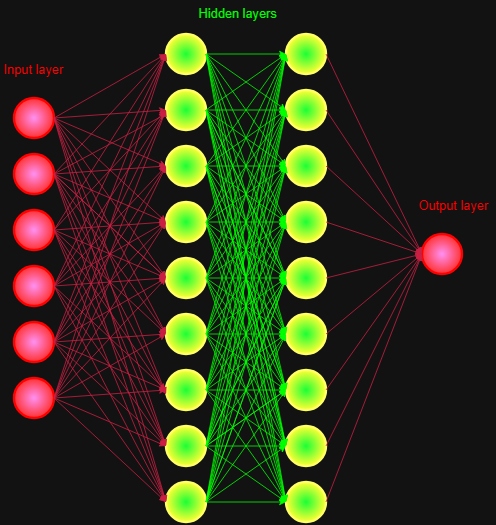

# Artificial Neural Network from Scratch

This project implements a **fully connected artificial neural network (ANN)** from scratch in Python, without using any deep learning libraries like TensorFlow or PyTorch.

## Features

- `Activation` class: Sigmoid and ReLU activation functions with derivatives.
- `Layer` class: Fully connected layer with forward and backward propagation.
- `NeuralNetwork` class: Allows stacking layers, training using Mean Squared Error loss, and making predictions.
- Modular structure: Each component is in its own file for clarity.

## Diagram of the Neural Network

